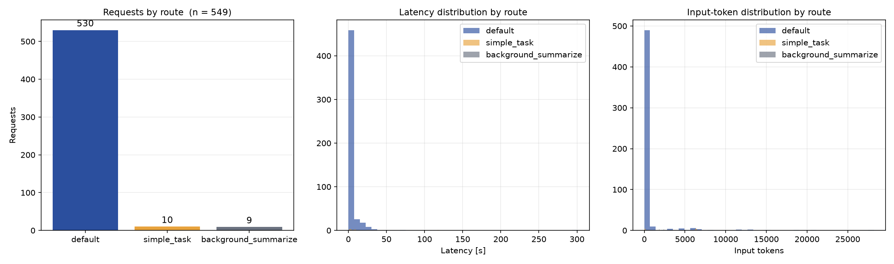

# Multi-Provider LLM Gateway with Cost-Aware Routing

**A request-level router that splits LLM traffic between a paid API and a free-tier pool — with explicit intent override, circuit breaking, automatic fallback, and per-request cost/latency instrumentation.**



---

## Why

Sending *every* request to one strong (expensive) model is the default, and it is wasteful: short prompts, classification calls, internal summaries and tool-driven turns rarely need it.

But routing on guesswork is worse than not routing — a router that silently sends a quality-sensitive task to a cheap model produces **confident, subtly wrong output**, which is far harder to notice than a failure.

This gateway is built around one principle: **the caller should be able to declare intent, rather than have the router guess it.**

---

## Results (549 real requests)

| Route | Requests | Median latency | Median input tokens |
|-------|---------:|---------------:|--------------------:|
| `default` → paid API | 530 | **1.40 s** | — |
| `simple_task` → free-tier pool | 10 | 8.93 s | 2,423 |
| `background_summarize` | 9 | 2.52 s | 1,824 |

The distribution is the interesting part: **routine traffic dominates the count, while the expensive-model calls are the minority.** That is exactly the shape routing is supposed to produce — and the instrumentation made it visible for the first time.

---

## How it works

```
   request ──▶ feature extraction ──▶ route decision ──▶ provider call
                     │                      │                 │
                     │                      ├─ X-Route header override?
                     │                      ├─ circuit breaker open?
                     │                      └─ fallback chain armed?
                     │
                     └─▶ JSONL log (route, provider, model, latency,
                                    in/out tokens, ok)
```

| Component | Role |
|-----------|------|
| **Feature extraction** | Input size, keyword signals, tool-call count, payload flags |
| **Route decision** | Rule table → `(route, provider, model)` |
| **`X-Route` override** | A header lets the caller declare intent (e.g. "quality first") and skip the heuristic entirely |
| **Circuit breaker** | A failing provider is tripped out instead of being retried forever |
| **Fallback chain** | Ordered providers per route; the next one takes over on failure |
| **Structured logging** | One JSONL record per request — the basis for every number above |

---

## Engineering findings

**1. Keyword routing misfires on long, structured tasks.**
Routing on signals like "summarise / classify / extract" worked for short prompts, but a **long, structured generation** task (a multi-thousand-word technical proposal) matched the same keywords and was sent to the cheap pool — where it took **119 s** instead of ~15 s.

The fix was not a better heuristic — it was **letting the caller declare intent**: an `X-Route` header bypasses the classifier entirely. *Declared intent beats guessed intent.*

**2. A free tier can hide a 27× latency regression.**
The free pool's model defaulted to an internal "thinking" mode. On short inputs the overhead was invisible; on long inputs it dominated — a **27× slowdown** that only showed up once per-request latency was logged. The environment was already in the repo; nobody had looked at it.

**3. Cost visibility changes behaviour.**
Per-request token accounting turned "the free tier is basically free" into "this class of request costs X per day". Visibility, not policy, changed where traffic went.

**4. Shared infrastructure must not be silently reconfigured.**
An early version rewrote the model field on the way through, which broke other consumers reading the same config. The gateway now treats routing as a *routing* concern and leaves the payload untouched.

---

## Quick start

```bash
python -m venv .venv && source .venv/bin/activate     # or: uv venv .venv
pip install -r requirements.txt

# Configure providers and routes
$EDITOR config.yaml

python router.py            # serves on :8787

# Call it — with an explicit intent override
curl http://127.0.0.1:8787/v1/chat/completions \
  -H "Content-Type: application/json" \
  -H "X-Route: default" \
  -d '{"model":"auto","messages":[{"role":"user","content":"hi"}]}'
```

Regenerate the figures:

```bash
python make_figures.py      # → results/routing_results.png
```

---

## Project structure

```
hermes-token-router/
├── router.py             # HTTP gateway: routing, override, breaker, fallback
├── providers.py          # provider adapters (OpenAI-compatible endpoints)
├── cache.py              # response cache
├── config.yaml           # routes, providers, thresholds
├── make_figures.py       # result figures from route logs
├── logs/route_log.jsonl  # per-request structured records (n = 549)
├── results/              # generated figures
├── README.md             # this file
└── README.zh.md          # Chinese version
```

---

## Limitations & next steps

- **Routing rules are hand-tuned.** A learned classifier over the logged features (each record already carries the routing outcome) is the natural next step.
- **No quality feedback loop.** The gateway optimises cost and latency; it does not yet measure whether the cheap route produced an acceptable answer. An offline eval harness would close that gap.
- **Single-node, in-process state.** Circuit-breaker state and the cost counters are process-local; a multi-instance deployment needs shared state.
- **Cache key is exact-match.** Semantic (embedding-based) caching would raise the hit rate considerably on repetitive traffic.

---

*Built to make LLM cost and latency visible at the request level — and to test one idea: declared intent beats guessed intent. MIT licensed.*
